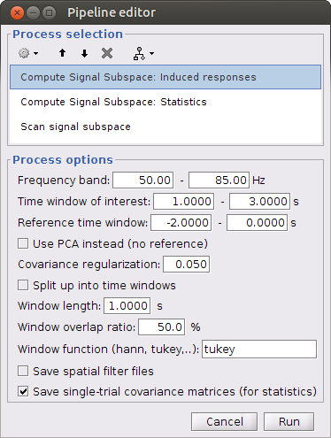
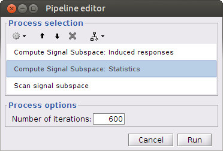
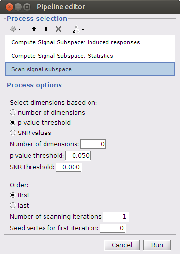
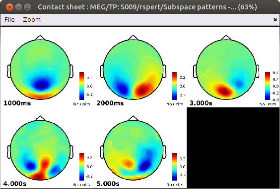
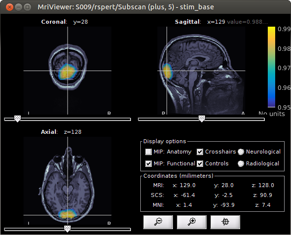

## Pipeline for detecting induced responses

### Single-subject level

Add data files in the Process1 tab, use the pipeline editor:

View spatial patterns:

View scanning results:

### Group level
